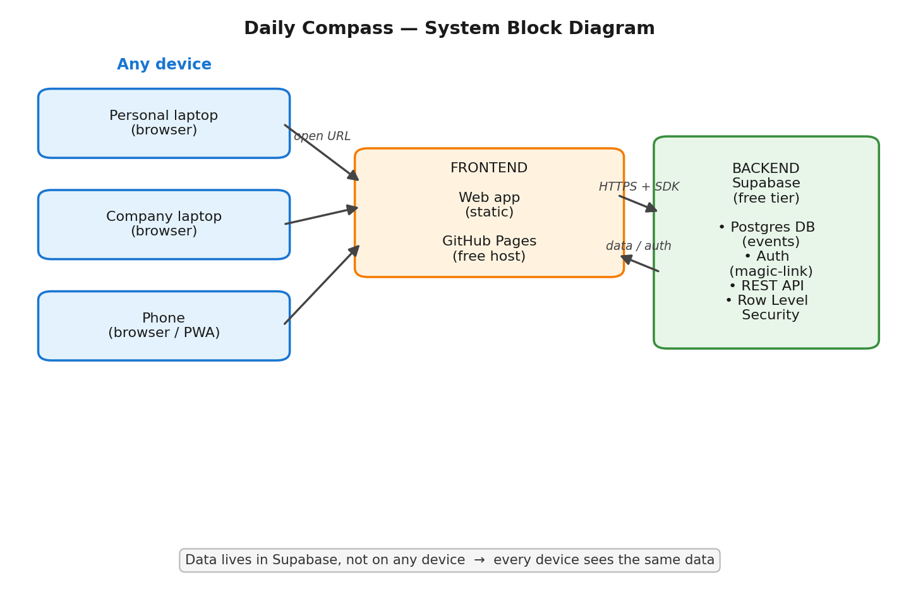

# Daily Compass — High-Level Design (HLD)

**Date:** 2026-06-24
**Status:** Approved (high-level)
**Owner:** general@riodlogic.com

## 1. Purpose

Daily Compass is a personal, single-user web app for recording dated and timed
events across different aspects of the owner's life (e.g. work, health,
personal). The owner enters events, views them, and sees upcoming events
highlighted on the page. The app is reachable from any device the owner uses —
personal laptop, company laptop, phone — and always shows the same data.

## 2. Goals and Non-Goals

### Goals (v1)
- Log in securely from any device.
- Add an event with an aspect, title, date/time, and optional notes.
- View events as a list and on a calendar.
- See upcoming events highlighted on the page (on-page reminder).
- Run on free hosting with no recurring cost.

### Non-Goals (v1 — deferred to later phases)
- Offline use and install-to-home-screen (PWA).
- External reminders (email or push notifications).
- Statistics and charts across aspects.
- Export to CSV / git backup.
- Native iOS/Android store apps.

## 3. Architecture

Two layers with a clean boundary between them.

### System Block Diagram



```
Frontend (web app)  ──HTTPS + Supabase SDK──►  Backend
   GitHub Pages                                  Supabase
   (free static host)                            (free tier)
```

Devices open the same app URL; data lives in the backend, not on any device, so
every device sees identical data.

```
company laptop ─┐
personal laptop ─┼─ open same URL ─► GitHub Pages (the app)
phone ──────────┘                          │
                                           ▼
                                    Supabase (the data)
```

### 3.1 Frontend
- Static web app hosted on **GitHub Pages** (free, static-only).
- App URL: `https://<user>.github.io/daily-compass` (default GitHub Pages URL;
  no custom domain needed).
- Implementation tech (plain HTML/CSS/JS vs. a light framework) is decided at
  the planning stage. Constraint: must build to static files hostable on GitHub
  Pages.

### 3.2 Backend — Supabase
- **Database:** Postgres, holds the events table.
- **Auth:** magic-link email login. Built-in.
- **API:** the frontend talks to Supabase over HTTPS using the Supabase JS SDK.
- **Security:** Row Level Security (RLS) restricts every row to its owning user.
  The browser uses the public **anon key**, which is safe to expose because it
  can do nothing without a valid login, and RLS blocks cross-user access. The
  secret service key is never placed in the browser.

## 4. Authentication Flow

1. On a new device, the user enters their email.
2. Supabase emails a one-time magic link.
3. The user clicks the link and is logged in.
4. The session token is stored in that browser and auto-refreshes, keeping the
   user logged in for weeks/months.
5. Subsequent opens on the same device are silent (no re-login).

Re-authentication is required only on a new device, after manual logout, after
a long session expiry, or if browser data is cleared.

## 5. Data Model

Starting schema for v1. Minimal and intended to be extended later (additional
aspects and fields refined in a later phase; not blocking v1).

**Table: `events`**

| Column       | Type        | Notes                                  |
|--------------|-------------|----------------------------------------|
| `id`         | uuid        | Primary key.                           |
| `user_id`    | uuid        | Owner; FK to auth user. RLS key.       |
| `aspect`     | text        | Category, e.g. work / health / personal. |
| `title`      | text        | What the event is.                     |
| `datetime`   | timestamptz | When the event occurs.                 |
| `notes`      | text        | Optional free text.                    |
| `created_at` | timestamptz | Row creation time; default now().      |

**RLS policy:** a user may read and write only rows where
`user_id = auth.uid()`.

## 6. Core Features (v1)

1. **Log in** — magic-link, persistent session.
2. **Add event** — aspect, title, date/time, optional notes.
3. **View events** — list view and calendar view.
4. **On-page reminder** — upcoming events highlighted when the app is open.

## 7. Later Phases (not v1)

- **PWA:** add `manifest.json`, a service worker (`sw.js`), and app icons to make
  the web app installable to the home screen (iPhone via Safari → Share → Add to
  Home Screen; Android via Chrome install prompt) and usable offline. No backend
  change.
- **External reminders:** email or push notifications before an event.
- **Stats/charts:** aggregate across aspects (Postgres SQL makes this easy).
- **Export:** dump events to CSV / commit to git for backup.
- **Native apps:** Supabase already provides iOS/Android/Flutter SDKs, so native
  store apps can reuse the same backend and data.

## 8. Cost

| Item                         | Cost        |
|------------------------------|-------------|
| GitHub account + Pages host  | $0          |
| Supabase free tier           | $0          |
| Magic-link login             | $0          |
| PWA (later)                  | $0          |
| **Total**                    | **$0**      |

Notes:
- A free Supabase project pauses after 7 days of zero activity; one click wakes
  it. Daily use avoids this.
- Free tier limits (e.g. 500 MB DB) are far beyond single-user needs.
- Optional paid extras, not required by this design: custom domain (~$10/yr,
  cosmetic) and native store fees (Apple $99/yr, Google $25 once).

## 9. Open Questions (resolve at planning stage)

- Frontend tech: plain HTML/CSS/JS or a light framework.
- Aspects: fixed list defined up front vs. freely added.
- Whether v1 needs any fields beyond the starting schema (e.g. location,
  done-checkbox, end-time).
